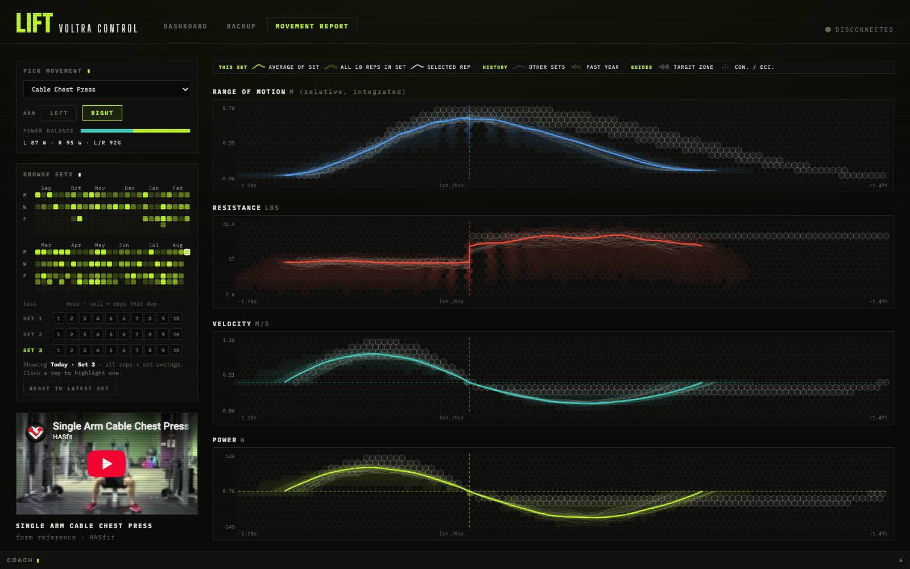

# VIGOR

A personal health dashboard. Today it centers on **Lift**, the page for a
VOLTRA cable machine: workout history, per-rep telemetry charts, targets,
backups, and an embedded AI coach.

> **Note:** this is a quick prototype of a local UI — it runs entirely on your
> machine, has no auth, and stores its data as JSON files next to the code.
> The machine's action catalog and CLI come from Beyond Power's
> [Cortex docs](https://cortex.beyond-power.com/docs).



## Pages

- **Lift** — connection status, workout history, weekly volume.
- **Backup** — snapshot the machine's account data into `backups/`. Also backs
  up Peloton: full workout history plus per-second performance metrics for up
  to two household users (Peloton retired password login, so the server runs
  the members-site OAuth + PKCE flow; credentials come from
  `PELOTON_LOGIN`/`PELOTON_PASSWORD` and optional `_2` variants, injected via
  `av inject +PELOTON_LOGIN +PELOTON_PASSWORD -- npm run serve`).
- **Movement Report** — the main event: pick a movement, browse a year of
  sessions on a contribution-style calendar, drill into a set or a single rep,
  and read four synced charts (range of motion, resistance, velocity, power)
  with target zones and a density lattice of the past year. Includes a
  left/right arm comparison, muscles-worked figure ([body-muscles](https://github.com/vulovix/body-muscles)),
  and a collapsible coach terminal pinned to the bottom of the screen.
  Ships with a fully mocked "Cable Chest Press" dataset so the page works
  without a device; real movements appear once telemetry is imported.

## Stack

- **Frontend** — React 19 + Vite, CSS modules, hand-rolled SVG charts
  (pixel-space viewBox, fit-to-screen on desktop, responsive down to phones).
- **Backend** — `server.cjs`, a dependency-free Node HTTP server that serves
  the built app and a small `/api`: it shells out to the [`voltra` CLI](https://voltra.fitness)
  for machine data, stores telemetry/targets/backups as JSON on disk, and
  pipes coach questions to the `claude` CLI (with a chart screenshot for
  visual grounding).

## Run it

On a new computer, set up the prerequisites first:

1. **Node ≥ 20.19** — `brew install nvm`, then `nvm install 20` (or use an
   existing Node install).
2. **`voltra` CLI** — install per the
   [Cortex getting-started docs](https://cortex.beyond-power.com/docs/getting-started),
   then `voltra scan` / `voltra connect` to pair the machine. Lands in
   `~/.voltra/bin`, which the server finds automatically.
3. **`claude` CLI** — `npm install -g @anthropic-ai/claude-code` (powers the
   embedded coach).

Steps 2–3 are optional: without them the app still runs and the Movement
Report falls back to the mocked dataset.

Then:

```sh
npm install
npm run dev      # vite dev server on :5173, proxies /api to :4321
npm run build    # build to dist/
npm run serve    # serve dist/ + API on :4321
```


## Data on disk

Runtime data lives next to the code and is gitignored: `backups/` (account
snapshots), `telemetry/` (imported per-rep session JSON), `targets.json`
(per-movement training targets).
